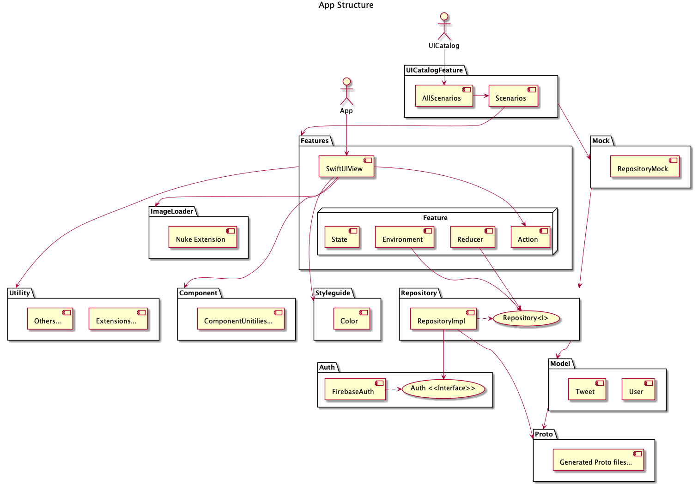

# TCA-SwiftUI-Template

## Get Started

### 開発の準備

ツール・サブモジュールの準備は↓を叩いてください。

```sh
make setup
```

## 開発の仕方

### 開発環境の開き方
↓のコマンドを叩くことで Xcode プロジェクトを開くことができます。
`swift package generate-xcodeproj` を叩く必要はありません。

```sh
make open
```

### 依存関係の追加の仕方

#### Swift Package Manager
新しくライブラリを追加したくなった場合は、 Xcode プロジェクトを開いた際サイドバーに `AppPackage/Package.swift` のファイルが見えるかと思いますのでそちらを開き、  `packages` に追加してください。
それ以降は各ライブラリで紹介されている方法に従ってください。

#### Carthage
プロジェクトルートにある `Cartfile` に依存関係を追加し、 `carthage update ...` コマンドを `--use-xcframeworks` オプション付きで実行してください。
追加した後、`AppPackage/Package.swift` の中の `targets` に `.binaryTarget(...)` を使用して作成した xcframework をターゲットに追加します。

#### CocoaPods
CocoaPods については未検証のため、検証した際は追記します。

### 開発ルール

#### ソースコードのフォーマット

```
make run-format
```

[swiftformat](https://github.com/nicklockwood/SwiftFormat)と[swift-mod](https://github.com/taoshotaro/swift-mod/tree/update-deps)に従いフォーマットが適用されます。
PR作成前に実行してください。

#### `import`文はアルファベット順に並べる

ブランチ間で依存関係の変更があった際、conflictを減らすことが目的

**Do:**
```swift
import AppFeature
import Combine
import Foundation
import SwiftUI
```

**Don't:**
```swift
import SwiftUI
import Combine
import Foundation

import AppFeature
```

#### PRレビューに関して

本リポジトリでは[`Pull request auto-merge`](https://docs.github.com/en/github/administering-a-repository/managing-auto-merge-for-pull-requests-in-your-repository)が有効になっています。
1approveでMergeされ、作業元branchが削除されます。

## 使用技術
- [kean/Nuke](https://github.com/kean/Nuke)
- [firebase/firebase-ios-sdk](https://github.com/firebase/firebase-ios-sdk)
- [pointfreeco/swift-composable-architecture](https://github.com/pointfreeco/swift-composable-architecture)
- [grpc/grpc-swift](https://github.com/grpc/grpc-swift)
- [airbnb/lottie-ios](https://github.com/airbnb/lottie-ios)
- [realm/SwiftLint](https://github.com/realm/SwiftLint)
- [nicklockwood/SwiftFormat](https://github.com/nicklockwood/SwiftFormat)
- [taoshotaro/swift-mod](https://github.com/taoshotaro/swift-mod/tree/update-deps)

## アプリアーキテクチャ

[pointfreeco/isowords](https://github.com/pointfreeco/isowords) を参考に作成しています。　

